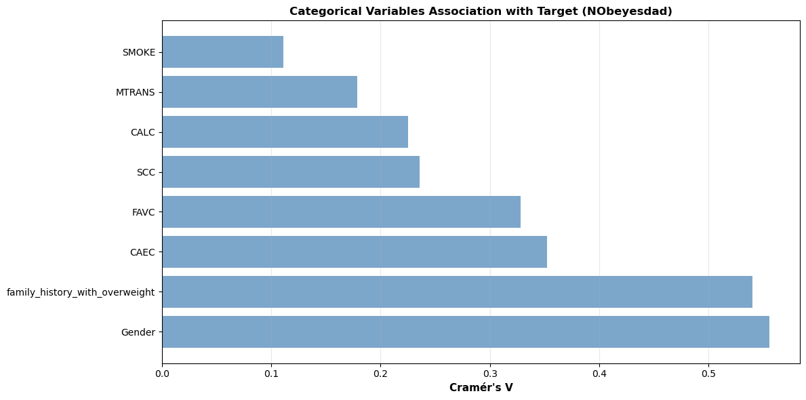
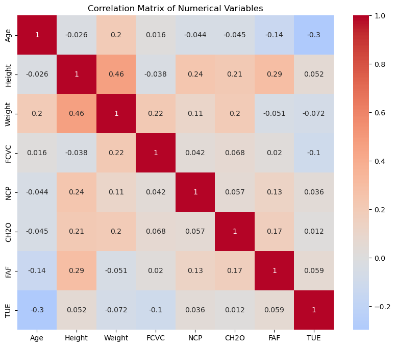
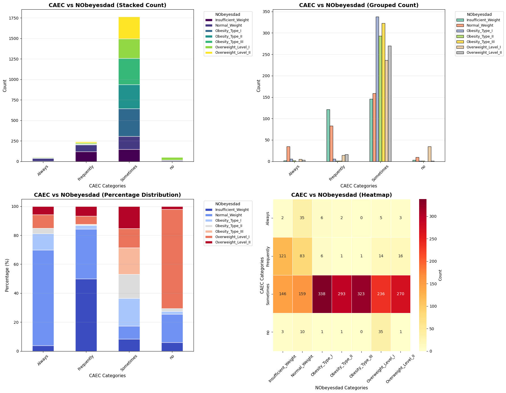
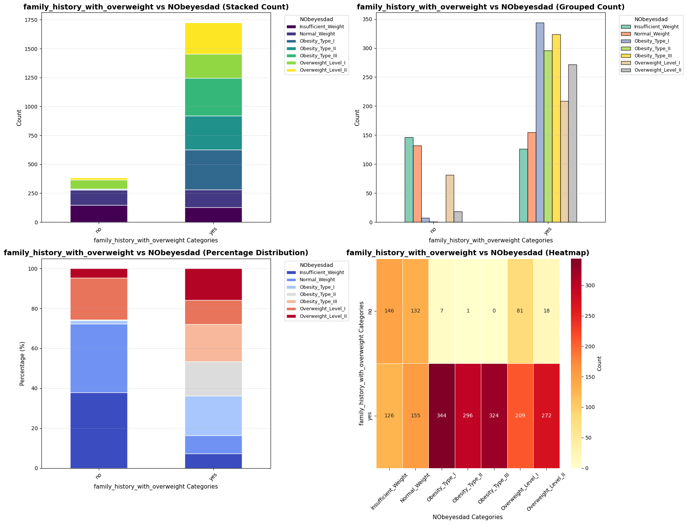
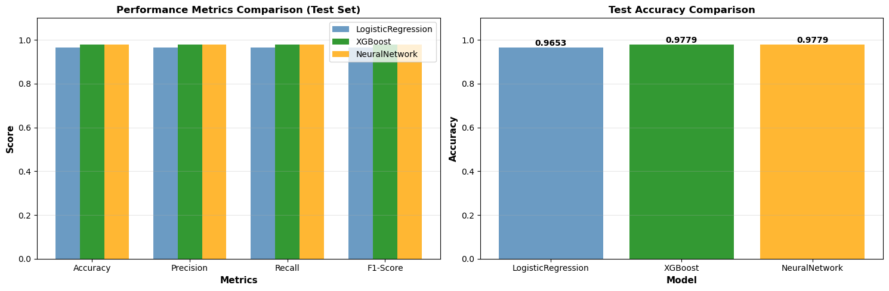
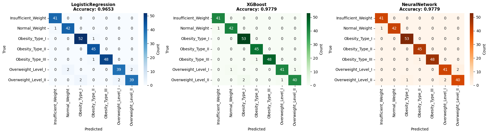
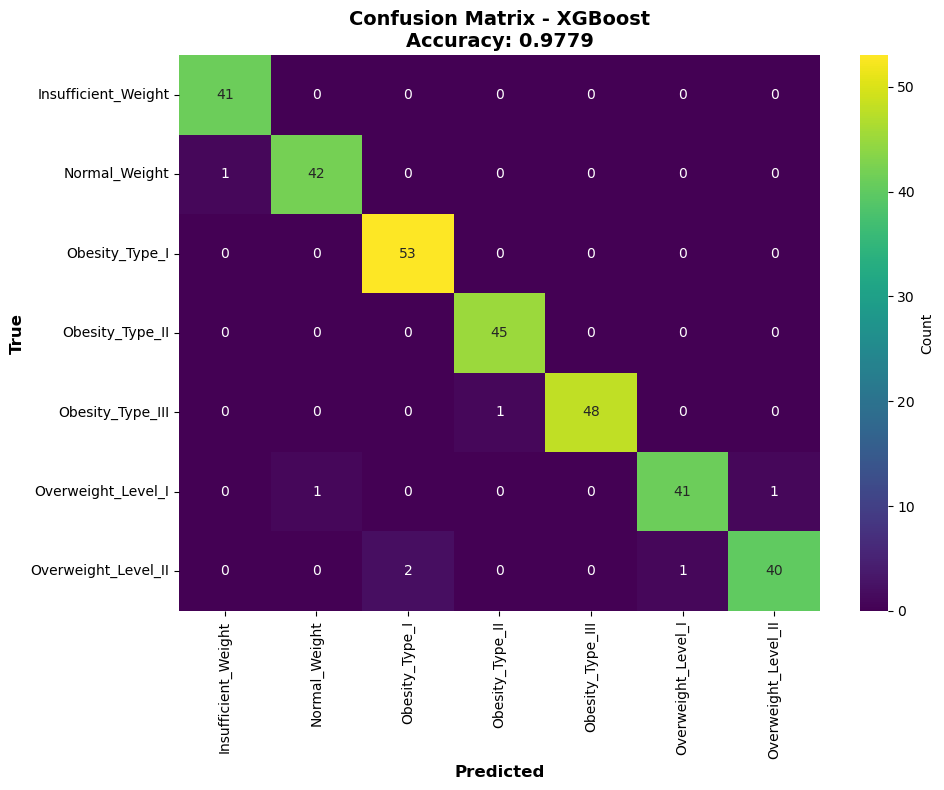

# Laporan Proyek Machine Learning - Ryandi Kresna Anugerah

## Domain Proyek

Obesitas adalah kondisi medis ketika seseorang memiliki kelebihan lemak tubuh yang berlebihan, biasanya diukur dengan Indeks Massa Tubuh (IMT) ≥ 30. Pada tahun 2025 ini, melalui laporan Child Nutrition Report 2025 'Feeding Profit: How food environments are failing children' Unicef mengungkap negara-negara berpenghasilan rendah dan menengah mengalami peningkatan prevalensi obesitas sangat pesat selama dua dekade terakhir. Ironisnya lagi kelebihan berat badan pada kalangan anak-anak dan remaja dalam rentang usia 5-19 tahun tercatat meningkat 3 kali lipat antara tahun 2000 dan 2022 dengan peningkatan dari 15% menjadi 25% [[1]](https://dinkes.jogjaprov.go.id/artikel/detail/obesitas-di-indonesia-tantangan-kesehatan-yang-semakin-meningkat).

**Alasan Pengambilan permasalan**
1. Deteksi Dini dan Prediksi Risiko:
2. Dampak Kesehatan Fisik yang Serius:
3. Beban Ekonomi Negara dan Individu:

**Referensi**

[1] Dinas Kesehatan Daerah Istimewa Yogyakarta, "Obesitas di Indonesia: Tantangan Kesehatan yang Semakin Meningkat," Dinas Kesehatan DIY, 15 Juli 2024.

## Business Understanding

### Problem Statements

- **Pernyataan Masalah 1**: Apa saja model Machine Learning yang dapat menghasilkan akurasi sistem paling tertinggi ?    
- **Pernyataan Masalah 2**: Apa saja faktor - faktor yang menyebabkan obesitas melalui data yang ada ? 

### Goals

- Jawaban pernyataan masalah 1 :
Melakukan perbandingan antar model yang digunakan dengan mentargetkan tingkat **test accuracy** pada yang lebih dari 96%

- Jawaban pernyataan masalah 2 : Melakukan tahapan Exploratory Data Analysis mendalam dan mencari pola keterhubungan antar fitur yang ada.

### Solution statements
1. Menggunakan Algoritma XGboost, Regresi Linear, dan Multi Layer Perceptron (Deep Learning) : Melakukan perbandingan antar algoritma yang digunakan.

## Data Understanding

### Informasi Data
Melalui penelitian ini, dataset yang digunakan adalah [Obesity Prediction Dataset](https://www.kaggle.com/datasets/ruchikakumbhar/obesity-prediction). Data ini mencakup detail-detail berikut:

1. **Jumlah Data**: Dataset terdiri dari 2111 sampel dan 17 fitur.
2. **Kondisi Data**: Data terdapat beberapa sampel yang terduplikat. 

### Penjelasan Fitur Data
Data-data ini dikelompokkan berdasarkan karakteristik fitur dataset.

1. **Sektor Fisik & Biologis** : Terdiri dari `age`, `weight`, `height`, dan `family_history_with_overweight` 
2. **Sektor Kebiasaan Makan** : Terdiri dari `FAVC`,`FCVC`,`NCP`,`CAEC`,`CH2O`, dan`CALC`
3. **Sektor Gaya Hidup & Aktivitas** : Terdiri dari `SMOKE`,`SCC`,`FAF`,`TUE`,`MTRANS`

### Variabel-variabel data obesitas dapat dilihat sebagai berikut:
- Age : Usia calon penderita
- height : Tinggi Badan calon penderita
- weight : Berat Badan calon penderita
- family_history_with_overweight : Apakah ada anggota keluarga yang pernah menderita atau sedang menderita kelebihan berat badan?
- FAVC : Apakah Anda sering mengonsumsi makanan berkalori tinggi?
- FCVC : Apakah Anda biasanya mengonsumsi sayuran dalam makanan Anda?
- NCP : Berapa banyak makanan utama yang Anda konsumsi setiap hari?
- CAEC : Apakah Anda mengonsumsi makanan di antara waktu makan?
- SMOKE : Apakah Anda merokok?
- CH2O : Berapa banyak air yang Anda minum setiap hari?
- SCC : Apakah Anda memantau kalori yang Anda konsumsi setiap hari?
- FAF: Seberapa sering Anda melakukan aktivitas fisik?
- TUE : Berapa lama waktu yang Anda habiskan untuk menggunakan perangkat teknologi seperti telepon seluler, video game, televisi, komputer, dan lainnya?
- CALC : Seberapa sering Anda minum alkohol?
- MTRANS : Transportasi apa yang biasanya Anda gunakan?
- NObeyesdad (Kolom Target) : Tingkat obesitas

## Exploratory Data Analysis

### **Korelasi antar data**

- **Korelasi Heatmap** :Melalui korelasi antar data yang dilakukan. Pada data numerical, `Weight` dan `Height` memiliki hubungan antar data yang teringgi. Kemudian korelasi pada data categorical `Gender` dengan `NObeyesdad` dan `family_history_with_overweight` dengan `NObeyesdad`. amun, setelah melakukan penggalian data (data mini) lebih mendalam terdapat korelasi data antar numerical-categorical. Data meliputi `Weight`-`CAEC`, dan `Weight`-`NObeyesdad`yang memiliki hubungan kuat antar feature yang ada.

### **Analisis Feature dan Target**

- **Distribusi antar data** : Jika diperhatikan lebih lanjut, fitur data seperti `CAEC`, `family_history_with_overweight`, dan `Weight` memiliki hubungan yang kuat anatara data yang ada pada fitur target/label `NObeyesdad`. Jika diperhatikan, bobot `weight` ini dipengaruh oleh `CAEC`dimamna calon penderita diketahui mengkonsumsi makanan pada malam hari. Selain itu juga, dipengaruhi oleh `family_history_with_overweight` dimana penderita memiliki histori keluarga yang obesitas. 

### **Insight EDA**
Melalui analisis yang dilakukan dapat disimpulkan:
1. **Obesitas dipengaruhi komsumsi pada malam hari** : Melalui analisis yang dilakukan, obesitas tingkat tinggi dipengaruhi oleh konsumsi dimalam hari dimana, tengah malam organ tubuh seharusnya istiharat.
2. **Histori keluarga yang obesitas mempengaruhi keterununan** : Obesitas dapat memberikan dampat buruk bagi beberapa keturunan yang terkena dampaknya.
3. **Diperlukannya tahap Feature Engineering** : Data yang digunakan bercampur dengan numerik dan kategori, sehingga diperlukan tahap encoding pada data kategori.

## Data Preparation

### **Tahapan**

1. Feature Engineering
  - Membuat pengelompokan data khususnya data numerik seperti `BMI`,`Age_Group`,`BMI_Category`, dan `Lifestyle_score`.
  - - Alasan : memudahkan algoritma untuk melakukan pengelompokan data `Age_Group` yang terdiri dari 3 kelompok (Young, Adult, dan Middle_Aged) dan Kelompok `BMI_Category` yang terdiri 4 kelompok (Underweight, Normal, Overweight, dan Obese).

2. Encoding Categorical Feature

  - Memberikan encoding pada data bersifat kategori (dtype = Object) dengan menggunakan teknik  One-Hot Encoding dan Label Encoding.
  - Alasan : Pada dasarnya, metode pada Machine Learning tidak memahami informasi yang bersifat `Object` yang mengharuskan mengubah nilai tersebut dalam `float` atau `Int`

3. Feature Scaling
  - Menggunakan metode numerik normalisasi `StandarScaler` yang membuat nilai feature memiliki nilai rerata nol dan standar deviasi satu.
  - Alasan : Normalisasi data memastikan skala data besar tidak mendominasi pada tahapan pelatihan data, sehingga menghindari performa algortima underfitting.   

4. Splitting Data
  - Data dibagi menjadi 3 set, yaitu training, valid, dan test. Dengan proporsi data 75%, 15%, dan 15% dengan total sample 1478 sample training, 316 sample validation, dan 317 sample testing.

5. Imbalance Handling
  - Dikarenakan jumlah sample label yang tidak seimbang, data tiap-tiap label dilakukan penyeimbangan sample menggunakan metode `Smote` yang sebelumnya sumlah sampel sebanyak 1478, menjadi 1722 sampel data.

6. Converting Numpy array to Tesorflow Tensor
  - Menerapkan integrasi ekosistem tensorflow yang memerlukan input objek `tensor` 

7. Creating Custom Tensorflow Dataset
  - Menangani data yang tidak dapat diproses dengan mudah menggunakan framework Tensorflow.

## Modeling
Pada tahapan modelling, saya menggunakan algoritma XGBoost, Logistic regression, dan Multi Layer Perceptron (DL).

### Modelling yang digunakan

1. XGboost
2. Logistic Regression
3. Multi Layer Perceptron

## Evaluation

### Metrik Evaluasi
  - Accuracy : Mengukur seberapa sering model membuat prediksi yang benar secara keseluruhan.
  - Precission : Dari semua data yang diprediksi positif oleh model, berapa banyak yang benar-benar positif ?
  - Recall : Dari semua data yang sebenarnya positif, berapa banyak yang berhasil dikenali oleh algortima ?
  - F1-Score : Rata-rata harmonik (harmonic mean) dari Precision dan Recall.
  - ROC AUC : Kurva ROC adalah plot probabilitas yang menggambarkan kinerja model klasifikasi pada berbagai threshold.

### Hasil Penelitian
Hasil ini menggunakan set data test sebagai pengujian performa algoritma yang digunakan.

**XGboost**

  - Accuracy : 0.9779
  - Precission : 0.9781
  - Recall : 0.9779
  - F1-Score : 0.9778
  - ROC AUC : 0.9982

**Regresi Linear**

  - Accuracy : 0.9653
  - Precission : 0.9653
  - Recall : 0.9653
  - F1-Score : 0.9650
  - ROC AUC : 0.9949

**Multi Layer Perceptron**

  - Accuracy : 0.9653
  - Precission : 0.9658
  - Recall : 0.9653
  - F1-Score : 0.9654
  - ROC AUC : 0.9982

### Formulasi Metriks

1. Accuracy

$$
\text{Accuracy} = \frac{TP + TN}{TP + TN + FP + FN}
$$

Keterangan :
  - TP adalah True Positive
  - TN adalah True Negative
  - FP adalah False Positive
  - FN adalah False Negative

2. Precission

$$
\text{Precision} = \frac{TP}{TP + FP}
$$

Keterangan : 
  - TP adalah True Positive
  - FP adalah False Positive

3. Recall

$$
\text{Recall} = \frac{TP}{TP + FN}
$$

Keterangan :
  - TP adalah True Positive
  - FN adalah False Negative

4. F1-Score

$$
\text{F1-Score} = 2 \times \frac{\text{Precision} \times \text{Recall}}{\text{Precision} + \text{Recall}}
$$

5. ROC AUC
Kurva ini memplot dua parameter:
  - True Positive Rate (TPR) alias Recall:

$$
\text{TPR} = \frac{TP}{TP + FN}
$$

  - False Positive Rate (FPR):

$$
\text{FPR} = \frac{FP}{FP + TN}
$$

## Hasil Penelitian

### Performa Model

### Model yang direkomendasikan

## Evaluasi Pengaruh Model Terhadap Business Understanding

1. Jawaban Pertanyaan 1 
Mengembangkan dan mencari hasil performa dari model yang digunakan menghasilkan tingkat test akurasi tertinggi

- Apakah telah menjawab goals yang diharapkan? Melalui target yang diharapkan. tegita model memiliki hasil yang luar biasa. ketiganya mampumenghasilkan akurasti test lebih dari 96%.

2. Jawaban Pertanyaan 2
Mengidentifikasi pengaruh penyebab obesitas melalui fitur data.

- Apakah fitur data yang direncanakan berdampak? Melalui analisis EDA yang dilakukan, fitur seperti `weight`, `family_history_with_overweight`, dan `CAEC` memiliki hubungan yang menyebabkan tingkat obesitas `NObeyesdad`  
